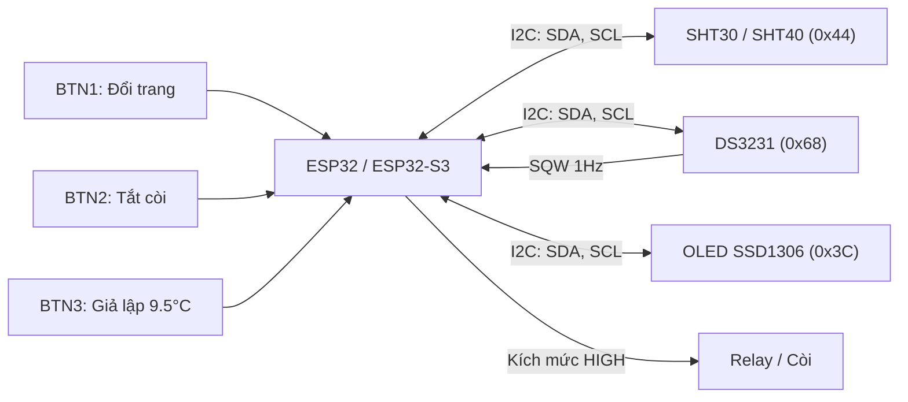

# Sơ đồ đấu nối phần cứng

Áp dụng cho **ESP32 Classic** (ESP32-WROOM-32 / DevKit v1) và **ESP32-S3** (DevKitC-1). Hỗ trợ cảm biến **SHT30** hoặc **SHT40** và IC RTC **DS3231**.

---

## 1. Quy tắc an toàn

1. Rút cáp USB trước khi cắm hoặc tháo dây.
2. Đọc đúng ký hiệu in trên mạch: `3V3`, `GND`, số hiệu chân GPIO.
3. Cấp nguồn 3V3 cho SHT30/SHT40, DS3231, OLED. Nối chung toàn bộ chân GND.

---

## 2. Bảng gán chân đối chiếu

| Thiết bị / Chức năng | Chân thiết bị | ESP32 Classic | ESP32-S3 | Lưu ý |
| :--- | :--- | :--- | :--- | :--- |
| **Cảm biến SHT30 / SHT40** | VCC | 3V3 | 3V3 | Nguồn 3.3V |
| | GND | GND | GND | Nối chung GND |
| | SDA | **GPIO21** | **GPIO8** | Chung bus I2C với OLED và RTC |
| | SCL | **GPIO22** | **GPIO9** | Chung bus I2C với OLED và RTC |
| **IC RTC DS3231** | VCC | 3V3 | 3V3 | Lắp pin CR2032 dự phòng |
| | GND | GND | GND | Nối chung GND |
| | SDA | **GPIO21** | **GPIO8** | Chung bus I2C |
| | SCL | **GPIO22** | **GPIO9** | Chung bus I2C |
| | SQW | **GPIO27** | **GPIO6** | Ngắt xung nhịp 1Hz |
| **Màn hình OLED SSD1306** | VCC / VDD | 3V3 | 3V3 | Nguồn 3.3V |
| | GND | GND | GND | Nối chung GND |
| | SDA | **GPIO21** | **GPIO8** | Chung bus I2C |
| | SCL / SCK | **GPIO22** | **GPIO9** | Chung bus I2C |
| **Nút bấm BTN1** | Chân tín hiệu | **GPIO32** | **GPIO4** | Đổi trang OLED, chân còn lại nối GND |
| **Nút bấm BTN2** | Chân tín hiệu | **GPIO33** | **GPIO5** | Tắt còi cảnh báo, chân còn lại nối GND |
| **Nút bấm BTN3** | Chân tín hiệu | **GPIO25** | **GPIO15** | Giả lập quá nhiệt 9.5°C, chân còn lại nối GND |
| **Nút BOOT** | Tích hợp sẵn | **GPIO0** | **GPIO0** | Giữ 5 giây để reset WiFi |
| **Cảnh báo Relay / LED** | IN / Anode | **GPIO26** | **GPIO7** | Mức HIGH kích hoạt cảnh báo |
| **Đo điện áp Pin** | Cầu phân áp | **GPIO34** | **GPIO1** | Cầu phân áp 2 trở 100k, tụ 100nF |
| **LED trạng thái** | Tích hợp sẵn | **GPIO2** | **GPIO2** | Đèn báo hệ thống |

> **Lưu ý cấu hình phần mềm:** Cả SHT30 và SHT40 đều dùng chung sơ đồ chân I2C ở trên. Loại cảm biến được chọn qua cờ `build_flags` trong `firmware/platformio.ini` (`-D SENSOR_TYPE_SHT40` hoặc `-D SENSOR_TYPE_SHT30`).

---

## 3. Sơ đồ nguyên lý


```mermaid
flowchart LR
    MCU["ESP32 / ESP32-S3"]
    SENSOR["SHT30 / SHT40 (0x44)"]
    RTC["DS3231 (0x68)"]
    OLED["OLED SSD1306 (0x3C)"]
    B1["BTN1: Đổi trang"]
    B2["BTN2: Tắt còi"]
    B3["BTN3: Giả lập 9.5°C"]
    ALARM["Relay / Còi"]

    MCU <-->|"I2C: SDA, SCL"| SENSOR
    MCU <-->|"I2C: SDA, SCL"| RTC
    MCU <-->|"I2C: SDA, SCL"| OLED
    RTC -->|"SQW 1Hz"| MCU
    B1 --> MCU
    B2 --> MCU
    B3 --> MCU
    MCU -->|"Kích mức HIGH"| ALARM
```

---

## 4. Mạch đo điện áp pin

Điện áp pin 3.7V đến 4.2V phải đi qua cầu phân áp chia đôi trước khi vào chân ADC:

```text
Cực dương Pin (+) ---- [ Trở R1: 100 kΩ ] ----+---- [ Trở R2: 100 kΩ ] ---- GND
                                              |
                                              +---- [ Tụ 100 nF ] --------- GND
                                              |
                                     GPIO34 (Classic) / GPIO1 (S3)
```

Bật cờ `GSP_BATTERY_CONNECTED=1` trong `platformio.ini` khi đã lắp mạch đo pin.
