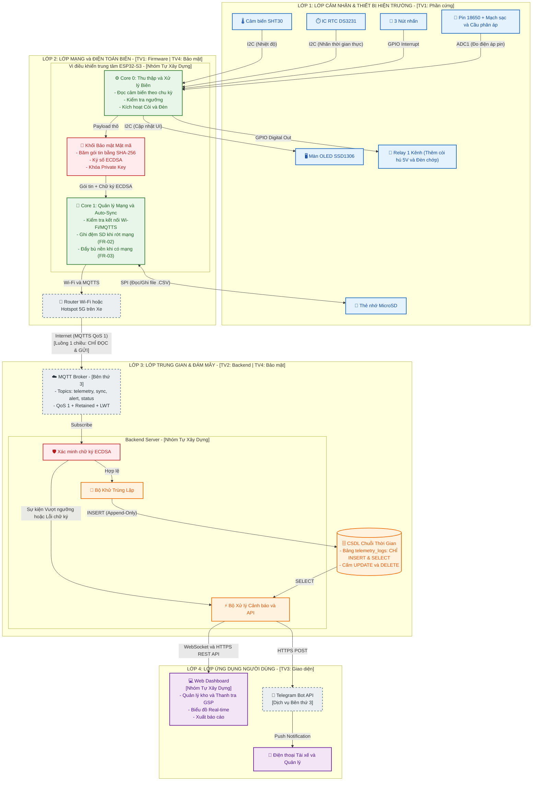

# Kiến trúc Bốn Lớp

```mermaid
flowchart TB
    %% Định nghĩa kiểu dáng cho các lớp
    classDef sensing fill:#e3f2fd,stroke:#1565c0,stroke-width:2px,color:#0d47a1
    classDef edge fill:#e8f5e9,stroke:#2e7d32,stroke-width:2px,color:#1b5e20
    classDef middleware fill:#fff3e0,stroke:#ef6c00,stroke-width:2px,color:#e65100
    classDef app fill:#f3e5f5,stroke:#6a1b9a,stroke-width:2px,color:#4a148c
    classDef thirdparty fill:#eceff1,stroke:#607d8b,stroke-width:2px,stroke-dasharray: 5 5,color:#263238
    classDef security fill:#ffebee,stroke:#c62828,stroke-width:2px,color:#b71c1c

    %% ================= LỚP 1: LỚP CẢM NHẬN / THIẾT BỊ =================
    subgraph L1 ["LỚP 1: LỚP CẢM NHẬN & THIẾT BỊ HIỆN TRƯỜNG - [TV1: Phần cứng]"]
        direction LR
        SHT30["🌡️ Cảm biến SHT30"]:::sensing
        DS3231["⏱️ IC RTC DS3231"]:::sensing
        OLED["🖥️ Màn OLED SSD1306"]:::sensing
        SDCARD["💾 Thẻ nhớ MicroSD"]:::sensing
        BTN["🔘 3 Nút nhấn"]:::sensing
        BAT["🔋 Pin 18650 + Mạch sạc và Cầu phân áp"]:::sensing
        RELAY["🚨 Relay 1 Kênh (Thêm còi hú 5V và Đèn chớp)"]:::sensing
    end

    %% ================= LỚP 2: LỚP MẠNG & ĐIỆN TOÁN BIÊN =================
    subgraph L2 ["LỚP 2: LỚP MẠNG và ĐIỆN TOÁN BIÊN - [TV1: Firmware | TV4: Bảo mật]"]
        direction TB
        subgraph ESP32S3 ["Vi điều khiển trung tâm ESP32-S3 - [Nhóm Tự Xây Dựng]"]
            CORE0["⚙️ Core 0: Thu thập và Xử lý Biên<br/>- Đọc cảm biến theo chu kỳ<br/>- Kiểm tra ngưỡng<br/>- Kích hoạt Còi và Đèn"]:::edge
            CRYPTO["🔐 Khối Bảo mật Mật mã<br/>- Băm gói tin bằng SHA-256<br/>- Ký số ECDSA<br/>- Khóa Private Key"]:::security
            CORE1["🔄 Core 1: Quản lý Mạng và Auto-Sync<br/>- Kiểm tra kết nối Wi-Fi/MQTTS<br/>- Ghi đệm SD khi rớt mạng (FR-02)<br/>- Đẩy bù nền khi có mạng (FR-03)"]:::edge
        end
        WIFI_GW["📡 Router Wi-Fi hoặc Hotspot 5G trên Xe"]:::thirdparty
    end

    %% Kết nối Lớp 1 <-> Lớp 2
    SHT30 -- "I2C (Nhiệt độ)" --> CORE0
    DS3231 -- "I2C (Nhãn thời gian thực)" --> CORE0
    CORE0 -- "I2C (Cập nhật UI)" --> OLED
    BTN -- "GPIO Interrupt" --> CORE0
    BAT -- "ADC1 (Đo điện áp pin)" --> CORE0
    CORE0 -- "GPIO Digital Out" --> RELAY
    CORE0 -- "Payload thô" --> CRYPTO
    CRYPTO -- "Gói tin + Chữ ký ECDSA" --> CORE1
    CORE1 <-- "SPI (Đọc/Ghi file .CSV)" --> SDCARD
    CORE1 -- "Wi-Fi và MQTTS" --> WIFI_GW

    %% ================= LỚP 3: LỚP TRUNG GIAN / MÁY CHỦ =================
    subgraph L3 ["LỚP 3: LỚP TRUNG GIAN & ĐÁM MÂY - [TV2: Backend | TV4: Bảo mật]"]
        direction TB
        BROKER["☁️ MQTT Broker - [Bên thứ 3]<br/>- Topics: telemetry, sync, alert, status<br/>- QoS 1 + Retained + LWT"]:::thirdparty
        
        subgraph BACKEND ["Backend Server - [Nhóm Tự Xây Dựng]"]
            VERIFY["🛡️ Xác minh chữ ký ECDSA"]:::security
            DEDUP["🧹 Bộ Khử Trùng Lặp"]:::middleware
            RULE["⚡ Bộ Xử lý Cảnh báo và API"]:::middleware
        end

        DB[("🗄️ CSDL Chuỗi Thời Gian<br/>- Bảng telemetry_logs: CHỈ INSERT & SELECT<br/>- Cấm UPDATE và DELETE")]:::middleware
    end

    %% Kết nối Lớp 2 -> Lớp 3 (Chỉ 1 chiều dữ liệu đo để đảm bảo tính pháp lý GSP)
    WIFI_GW -- "Internet (MQTTS QoS 1)<br/>[Luồng 1 chiều: CHỈ ĐỌC & GỬI]" --> BROKER
    BROKER -- "Subscribe" --> VERIFY
    VERIFY -- "Hợp lệ" --> DEDUP
    DEDUP -- "INSERT (Append-Only)" --> DB
    VERIFY -- "Sự kiện Vượt ngưỡng hoặc Lỗi chữ ký" --> RULE
    DB -- "SELECT" --> RULE

    %% ================= LỚP 4: LỚP ỨNG DỤNG NGƯỜI DÙNG =================
    subgraph L4 ["LỚP 4: LỚP ỨNG DỤNG NGƯỜI DÙNG - [TV3: Giao diện]"]
        direction LR
        WEB["💻 Web Dashboard<br/>[Nhóm Tự Xây Dựng]<br/>- Quản lý kho và Thanh tra GSP<br/>- Biểu đồ Real-time<br/>- Xuất báo cáo"]:::app
        TELE_API["🤖 Telegram Bot API<br/>[Dịch vụ Bên thứ 3]"]:::thirdparty
        PHONE["📱 Điện thoại Tài xế và Quản lý"]:::app
    end

    %% Kết nối Lớp 3 -> Lớp 4
    RULE -- "WebSocket và HTTPS REST API" --> WEB
    RULE -- "HTTPS POST" --> TELE_API
    TELE_API -- "Push Notification" --> PHONE
```